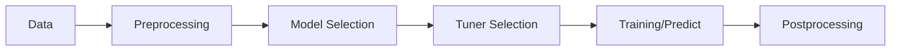

# Model and Tuner Registries

## ModelRegistry (`LGHackerton/models/registry.py`)

```python
from LGHackerton.models import ModelRegistry
trainer_cls = ModelRegistry.get("lgbm")
model = trainer_cls(cfg)
```

Requesting an unregistered model raises `ValueError: Unknown model '<name>'. Available models: ...`.
`train.py` and `predict.py` convert this into an `argparse` error so users
receive a concise message.

### CLI example

```bash
$ python LGHackerton/train.py --model unknown
usage: train.py [-h] [--progress | --no-progress] [--skip-tune]
                [--force-tune] [--trials TRIALS] [--timeout TIMEOUT]
                [--model MODEL]
train.py: error: Unknown model 'unknown'. Available models: patchtst, lgbm, tft
```

## TunerRegistry and HyperparameterTuner (`LGHackerton/tuning/registry.py`, `LGHackerton/tuning/base.py`)

`TunerRegistry.get(name)` returns a class implementing the
`HyperparameterTuner` interface.

| Method | Returns | Exceptions |
|-------|---------|------------|
| `run(n_trials, force)` | dict of best parameters | propagates `TypeError`/`ValueError` from `validate_params`; may raise `RuntimeError` for missing dependencies |
| `best_params()` | dict written to `best_params.json` | `RuntimeError` if `run` has not executed |
| `validate_params(params)` | `None` | `TypeError` for missing fields, `ValueError` for out-of-range values |

### CLI usage

```bash
python LGHackerton/train.py --model lgbm --trials 30
```

### Examples

```python
from LGHackerton.tuning.lgbm import LGBMTuner
lgbm_tuner = LGBMTuner(pp, df, cfg)
lgbm_tuner.run(n_trials=30, force=False)
```

```python
from LGHackerton.tuning.tft import TFTTuner
tft_tuner = TFTTuner(pp, df, cfg)
tft_tuner.run(n_trials=50, force=True)
```

Parameter validation failures in these tuners raise `TypeError` when required
fields are missing and `ValueError` when a value lies outside the allowed
range.

## Exception handling

- Unregistered model → `ValueError`
- Parameter validation failure → `TypeError`/`ValueError`

In `train.py`, preprocessing, tuning, and training failures are logged via
`logging.error` and halt the run. Unknown models surface through `parser.error`
messages. `predict.py` mirrors this behaviour when resolving trainers.

## Pipeline flow



## Regression tests

Verify the PatchTST pipeline remains intact:

```bash
pytest tests/test_pipeline_patchtst.py
```
